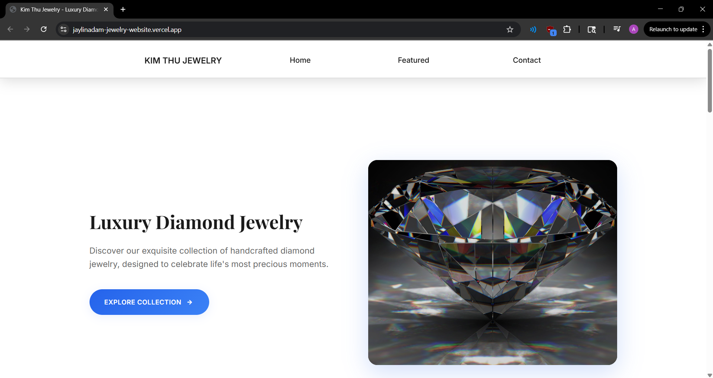

# Kim Thu Jewelry - Luxury Diamond Website

A modern, responsive jewelry website built for Kim Thu Jewelry featuring Shopify integration, enhanced contact forms, and performance optimizations. Currently running in mock mode for development and testing.

## Live Demo  
Website deployed on Vercel: https://jaylinadam-jewelry-website.vercel.app
[](https://jaylinadam-jewelry-website.vercel.app)

## Key Features

- **E-commerce Integration**: Shopify Buy Button & Storefront API support
- **Performance Optimized**: Web Vitals monitoring, lazy loading, font optimization
- **Accessibility Compliant**: WCAG 2.1 AA standards with keyboard navigation
- **Responsive Design**: Mobile-first approach with clean, modern UI
- **Contact System**: Enhanced forms with Netlify/Formspree integration
- **SEO Ready**: Sitemap, robots.txt, and meta tag optimization

## Tech Stack

- **Frontend**: HTML5, CSS3, JavaScript (ES6+)
- **E-commerce**: Shopify API integration
- **Performance**: Web Vitals monitoring, image optimization
- **Deployment**: Netlify/Vercel ready
- **Development**: ESLint, Prettier, Live Server

## Quick Start

```bash
# Clone and install
git clone <your-repo-url>
cd jewelry_website/jewelry_landing
npm install

# Start development server
npm run dev
```

Visit `http://localhost:3000` to see the site.

## Environment Setup

<details>
<summary>Click to expand environment configuration</summary>

Copy `.env.example` to `.env` and configure:

```bash
cp .env.example .env
```

**Environment Variables:**

```env
# Shopify Configuration
SHOP_MODE=mock                    # mock, buy-button, or storefront
SHOPIFY_STORE_DOMAIN=             # yourstore.myshopify.com
SHOPIFY_STOREFRONT_TOKEN=         # Storefront API token
SHOPIFY_COLLECTION_ID=            # Collection ID for buy button

# Contact Form
CONTACT_SINK=netlify              # netlify or formspree
FORMSPREE_ID=                     # Formspree form ID
```

</details>

## Shopify Integration

<details>
<summary>Click to expand Shopify setup details</summary>

### Current Mode: Mock (Development)

```env
SHOP_MODE=mock
```

### Buy Button Mode

1. Get Shopify store domain from Admin → Settings → General
2. Get collection ID from Products → Collections
3. Update `.env`:
   ```env
   SHOP_MODE=buy-button
   SHOPIFY_STORE_DOMAIN=mystore.myshopify.com
   SHOPIFY_COLLECTION_ID=123456789
   ```

### Storefront API Mode

1. Create Storefront API access token in Apps → App settings
2. Configure Storefront API scopes
3. Update `.env`:
   ```env
   SHOP_MODE=storefront
   SHOPIFY_STORE_DOMAIN=mystore.myshopify.com
   SHOPIFY_STOREFRONT_TOKEN=your_access_token
   ```

</details>

## Contact Form Setup

<details>
<summary>Click to expand contact form configuration</summary>

### Netlify Forms (Recommended)

- Deploy to Netlify
- Forms automatically detected
- No additional configuration needed

### Formspree Alternative

1. Sign up at [Formspree.io](https://formspree.io)
2. Create new form and copy form ID
3. Update `.env`:
   ```env
   CONTACT_SINK=formspree
   FORMSPREE_ID=your_form_id
   ```

</details>

## Deployment

### Netlify (Recommended)

1. Connect GitHub repository
2. Build command: `npm run build`
3. Publish directory: `.` (root)
4. Add environment variables in dashboard

### Vercel

1. Import GitHub repository
2. Build command: `npm run build`
3. Output directory: `.`
4. Add environment variables

## Performance & Quality

- **Lighthouse Performance**: ≥ 90
- **Lighthouse Accessibility**: ≥ 95
- **Core Web Vitals**: All green
- **WCAG 2.1 AA Compliant**

<details>
<summary>Click to expand performance features</summary>

- Image lazy loading and optimization
- Font optimization with `font-display: swap`
- Critical resource preloading
- Web Vitals monitoring (dev mode)
- Script optimization and deferring

</details>

## Testing

<details>
<summary>Click to expand testing details</summary>

### Manual Testing Checklist

- [ ] Homepage loads correctly
- [ ] Navigation works on mobile/desktop
- [ ] Contact form validation and submission
- [ ] Shopify integration (both modes)
- [ ] Cart functionality (storefront mode)
- [ ] Performance scores meet targets

### Automated Testing

```bash
npm run lint      # Code linting
npm run build     # Build test
npm run format    # Code formatting
```

</details>

## Project Structure

```
jewelry_website/
├── jewelry_landing/          # Main website code
│   ├── assets/               # CSS, JS, images
│   ├── index.html           # Main HTML file
│   └── package.json         # Dependencies
├── public/                  # Static assets (favicon, og.jpg)
├── .github/workflows/       # CI/CD pipeline
├── .env.example            # Environment template
└── [config files]          # ESLint, Prettier, etc.
```

<details>
<summary>Click to expand detailed project structure</summary>

```
jewelry_website/
├── jewelry_landing/          # Main website code
│   ├── assets/
│   │   ├── css/styles.css    # Main stylesheet
│   │   ├── js/
│   │   │   ├── main.js      # Main JavaScript
│   │   │   └── performance.js # Performance monitoring
│   │   └── img/             # Images
│   ├── index.html           # Main HTML file
│   ├── package.json         # Dependencies and scripts
│   └── node_modules/        # Dependencies
├── public/                  # Static assets
│   ├── favicon.ico         # Site favicon
│   └── og.jpg             # Open Graph image
├── .github/
│   └── workflows/
│       └── ci.yml          # GitHub Actions CI
├── .env.example            # Environment variables template
├── .gitignore             # Git ignore rules
├── .prettierrc            # Prettier configuration
├── .eslintrc.json         # ESLint configuration
├── README.md             # This file
├── LICENSE               # MIT License
├── robots.txt            # SEO robots file
└── sitemap.xml           # SEO sitemap
```

</details>

## Troubleshooting

<details>
<summary>Click to expand troubleshooting guide</summary>

### Common Issues

**Shopify products not loading:**

- Check store domain and token
- Verify CORS settings in Shopify
- Check browser console for errors

**Contact form not working:**

- Verify Netlify Forms is enabled
- Check form name attribute matches
- Test with different email addresses

**Performance issues:**

- Check image sizes and formats
- Verify lazy loading is working
- Monitor Core Web Vitals

### Getting Help

- Check browser console for errors
- Verify all environment variables are set
- Test in incognito mode
- Check network tab for failed requests

</details>

---

**Project Details:**

- **Client:** Kim Thu Jewelry
- **Type:** E-commerce Website
- **Technologies:** HTML, CSS, JavaScript, Shopify API
- **Status:** Development Complete, Ready for Production
- **License:** MIT
